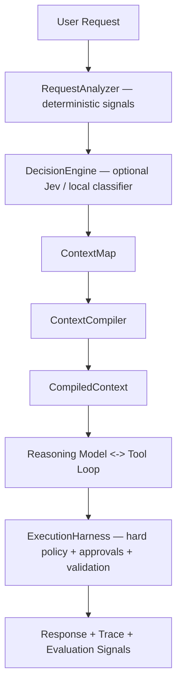

# BUD — Context Harness Rework: Technical Roadmap

Technical roadmap for Context Map, ContextCompiler, typed decisions, cognitive memory, adaptive capabilities, and execution policy.

| Target | Design influences | North-star |
| --- | --- | --- |
| mriver15/bud | Friday cognitive memory + Jev-style typed decisions | Compile the minimum sufficient, policy-safe context for each inference while preserving Bud's provider-neutral, local-first architecture. |

**Status:** Rework proposal following Bud's existing ToolPlanner/token-budget work. This document assumes the current architecture already supports request-scoped tool exposure, MCP delegation, bounded conversation context, ranked skills/memory, stored-result handles, cost measurement, profiling, subagents, and generated UI.

**Core thesis:** Bud should evolve from a model-centered agent loop into a harness with four explicit responsibilities: understand the request, assemble a typed Context Map, compile minimal model context, and enforce execution policy. Friday informs the knowledge/context side; Jev informs the fast typed-decision side. Neither should become a hard architectural dependency.

---

## 1. Desired End State

**Current strength.** Bud already avoids paying the full tool inventory on every request: the public README reports a generic request carrying 3,396 schema characters instead of 19,591 on a 26-tool registry, plus MCP-as-agent delegation that reduced one 21-tool server from 17,915 to 5,494 request tokens.

**Next problem.** Context selection is still distributed across several subsystems: tool planning, memory ranking, skill ranking, history trimming/compaction, delegate discovery, UI capability discovery, and provider request construction. The rework centralizes these into a measurable harness pipeline without replacing the working agent loop all at once.

### Target request path



ContextMap holds: intent / entities / complexity; capability scores; memory candidates; skill candidates; delegate candidates; risk / mutation intent; token budget.

ContextCompiler runs: CapabilityResolver, MemoryResolver, SkillResolver, HistoryCompactor, SchemaCompressor, BudgetAllocator.

## 2. Architectural Principles

| Principle | Requirement |
| --- | --- |
| P1 — Harness owns policy | The model proposes; Bud decides what context is supplied, what tools are legal, what approvals are required, and what data may leave the machine. |
| P2 — Context is compiled, not accumulated | Every context source competes for a bounded budget. No subsystem receives an unconditional right to append arbitrary prompt text. |
| P3 — Decisions are typed | Routing questions return enums, booleans, scores, probabilities, and confidence — not prose that must be parsed. |
| P4 — Deterministic before probabilistic | URLs, attachments, explicit server names, file paths, active browser state, and hard permissions should be resolved in code before calling a classifier. |
| P5 — Classifiers advise; policy enforces | A Jev-like engine may assess risk or relevance but can never bypass filesystem/network/tool restrictions or required approvals. |
| P6 — Progressive disclosure | The model initially sees capability summaries; detailed schemas, delegate rosters, memory bodies, and skill bodies appear only when relevant. |
| P7 — Provider neutrality | Jev is an optional DecisionEngine provider. Bud remains usable with deterministic routing and its configured chat provider. |
| P8 — Everything is observable | Every context inclusion/exclusion and decision records a reason, confidence, token estimate, latency, and policy version. |

## 3. New Core Domain Model

### 3.1 ContextMap

**Purpose.** A typed intermediate representation of what Bud currently believes is relevant before any provider-specific prompt is constructed. It is not itself the prompt.

```swift
struct ContextMap: Sendable, Codable {
    let requestID: UUID
    let intent: IntentAssessment
    let entities: [ContextEntity]
    let capabilities: [CapabilityAssessment]
    let memories: [MemoryCandidate]
    let skills: [SkillCandidate]
    let delegates: [DelegateCandidate]
    let execution: ExecutionAssessment
    let budget: ContextBudget
    let provenance: [ContextDecision]
}
```

| Field | Meaning |
| --- | --- |
| intent | Task class, complexity, ambiguity, read/write/execute posture, desired output mode. |
| entities | Projects, paths, URLs, MCP server names, applications, people/things mentioned by the request. |
| capabilities | Scored capability groups such as files, browser, web, memory, UI, shell, delegates, and individual MCP domains. |
| memories / skills | Candidates only; full bodies are not yet injected. |
| delegates | Candidate agents/MCP delegates with compact descriptions and scores. |
| execution | Risk class, external-data boundary, mutation intent, approval expectations. |
| budget | Total context target plus reservations for output and tool loop headroom. |
| provenance | Why each candidate exists: explicit mention, deterministic signal, classifier score, previous successful use, fail-open recovery. |

### 3.2 DecisionEngine

```swift
protocol DecisionEngine: Sendable {
    func evaluate(
        state: DecisionState,
        questions: [DecisionQuestion]
    ) async throws -> DecisionBatch
}

enum DecisionQuestion {
    case boolean(id: String, instructions: String)
    case choice(id: String, options: [String], instructions: String)
    case score(id: String, levels: [String], instructions: String)
}
```

**Implementations.** `DeterministicDecisionEngine` is always available; `ProviderDecisionEngine` can use the configured LLM as a fallback; `JevDecisionEngine` is optional; a future local classifier can satisfy the same contract.

**Batching.** Questions that share the same state should be evaluated together. Jev's documented model is specifically suited to evaluating multiple typed questions against one state in parallel, making capability routing, complexity, output-mode, and soft-risk assessment good candidates for a single classifier request.

### 3.3 ContextCompiler

```swift
protocol ContextCompiling: Sendable {
    func compile(
        map: ContextMap,
        history: [ChatMessage],
        inventory: CapabilityInventory,
        provider: ProviderCapabilities
    ) async throws -> CompiledContext
}

struct CompiledContext {
    let system: String
    let messages: [ChatMessage]
    let tools: [ToolDescriptor]
    let metadata: CompilationReport
}
```

**Rule.** `ContextCompiler` must be a pure-ish transformation over typed inputs. It should not execute user tools. Retrieval helpers may run before compilation, but their results must enter the map with provenance.

### 3.4 CapabilityIndex

**Purpose.** Replace large always-on schemas/rosters with a compact discoverability layer. A capability is not necessarily a tool; it may resolve to a tool group, delegate, skill, or output dialect.

```swift
Capability(
    id: "ui",
    summary: "structured cards, metrics, tables, charts, images",
    activation: .toolGroup("interface"),
    aliases: ["dashboard", "chart", "comparison", "visualize"]
)

Capability(
    id: "mcp.getcompetitive",
    summary: "competitive Pokemon data, teams, counters, metagame analysis",
    activation: .delegate("getcompetitive"),
    aliases: ["pokemon", "vgc", "smogon"]
)
```

**Constraint.** The base capability index needs a hard byte/token ceiling. If the inventory grows beyond the ceiling, include top-ranked summaries plus an O(1) discovery primitive rather than serializing the whole roster.

## 4. Friday-Inspired Cognitive Context Layer

**What to adopt.** Friday's useful pattern is separation of durable facts, episodic memory, and graph relationships, then targeted retrieval/compiled context instead of a static prompt tax. Friday exposes only four MCP tools and reports its own benchmark at roughly 280 prompt tokens/turn versus 3,150 for static prompts; those numbers are project-reported and should not be assumed for Bud.

**What not to adopt.** Do not introduce Docker, Neo4j, Mem0, ChromaDB, or an external always-on service into Bud's core. Bud's product advantage is a native, local-first macOS application with no required infrastructure.

### 4.1 Memory schema rework

| Record | Required fields | Behavior |
| --- | --- | --- |
| Fact | id, subject, predicate/key, value, scope, version, status, source, timestamps | Canonical/versioned assertion. Superseding a fact marks the previous version inactive rather than silently overwriting. |
| Episode | id, summary, scope, timestamp, source conversation/tool, salience | What happened or was decided; searchable and compactable. |
| Entity | id, type, canonicalName, aliases | Stable node for project/tool/server/file/person/product/etc. |
| Relation | from, type, to, confidence, source | Directed edge such as `PROJECT_USES_MCP`, `SKILL_ALLOWS_TOOL`, `MEMORY_ABOUT_PROJECT`. |
| Directive | id, text, scope, authority, status, source | User-authored or app-authored durable instruction; never created from untrusted web/tool text without explicit policy. |

### 4.2 SQLite cognitive store

**Storage.** Use SQLite as the canonical local store. FTS5 covers lexical retrieval; an optional vector table can be added later without making embeddings mandatory. Directed relations are ordinary indexed rows and recursive CTEs can cover the modest graph traversals Bud needs.

```sql
facts(id, entity_id, key, value_json, version, status, scope, source_id, created_at)
episodes(id, summary, body_handle, scope, salience, source_id, created_at)
entities(id, type, canonical_name, metadata_json)
entity_aliases(entity_id, alias)
relations(id, from_id, relation_type, to_id, confidence, source_id)
directives(id, text, scope, authority, status, source_id, created_at)
memory_fts(rowid, searchable_text)
context_events(id, request_id, source_type, source_id, action, score, reason)
```

**Migration.** Import existing `remember` records as Episodes by default. Promote obviously structured user/project facts only when the source format is unambiguous; do not infer a large fact graph during migration.

### 4.3 Retrieval pipeline

1. query
2. exact scope/entity matches
3. FTS lexical candidates
4. optional semantic candidates
5. graph neighbors (bounded depth)
6. recency/salience weighting
7. conflict/version resolution
8. candidate scoring
9. token-budget selection
10. `ContextMap.memories`

**Important.** Retrieval should be ranked and budgeted rather than binary. Bud's current rationale for not fully filtering memory remains valid: zero lexical overlap does not imply irrelevance. The difference is that the full long-tail list should no longer be serialized without a hard budget.

## 5. Jev-Inspired Typed Decision Layer

### 5.1 Initial decision batch

| Decision | Type | Used by |
| --- | --- | --- |
| needs_files | Boolean | CapabilityResolver |
| needs_browser | Boolean | CapabilityResolver |
| needs_web | Boolean | CapabilityResolver |
| needs_memory | Boolean | MemoryResolver |
| needs_ui | Boolean | OutputPlanner |
| needs_delegate | Boolean | DelegateResolver |
| complexity | Choice: trivial / normal / complex / long_horizon | ModelRouter / budget |
| mutation_intent | Choice: read / local_write / execute / external_mutation | ExecutionHarness |
| primary_domain | Choice over compact capability groups | CapabilityResolver |
| ambiguity | Score: low / medium / high | Clarification policy |

### 5.2 Decision precedence

| Priority | Source | Example |
| --- | --- | --- |
| 1 | Hard deterministic policy | Tool disabled; path outside allowed scope; approval required. |
| 2 | Explicit user intent | "Use the GitHub server"; attached file; pasted URL. |
| 3 | Deterministic request signals | Recognized file path, URL, active browser session, exact capability alias. |
| 4 | Typed classifier | Jev/local classifier estimates capability relevance, complexity, ambiguity, soft risk. |
| 5 | Sticky execution evidence | A tool/capability succeeded in the previous round and remains contextually relevant. |
| 6 | Fail-open expansion | A model attempts unavailable capability or execution cannot proceed with selected set. |

### 5.3 Confidence policy

- `confidence >= 0.85` → activate capability directly
- `0.55 ... 0.85` → advertise compact capability; expand on demand
- `< 0.55` → omit unless deterministic signal or sticky evidence exists

NOTE: thresholds are configuration/eval outputs, not permanent constants.

**Calibration.** Do not tune thresholds from intuition. Record planner decisions and outcome traces, then optimize against holdout evals. LangChain's current harness work explicitly emphasizes eval-driven harness changes and holdout sets to prevent overfitting.

## 6. Capability and Tool Rework

### 6.1 Two-stage tool exposure

**Stage A — discovery.** The first model request carries a tiny recovery core plus activated capability groups. It does not need the full delegate roster or every optional UI schema.

**Stage B — expansion.** When the planner/classifier or model requests a capability, Bud expands the relevant schemas on the next inference. Explicit user intent can skip Stage A and activate immediately.

### 6.2 Delegate roster becomes O(1) prompt cost

**Problem.** Bud currently generates the available delegate roster into `spawn_subagents` so the model can choose from the actual inventory. This is accurate but makes prompt cost grow with delegate count.

**Rework.** Keep the delegate index local. The model supplies a capability query or compact delegate ID selected by the harness.

```json
spawn_subagents(tasks: [
    {
        "capability": "competitive pokemon analysis",
        "instruction": "Compare these two teams..."
    }
])

// local DelegateResolver maps capability -> delegate ID(s)
// only selected delegate metadata enters the child run
```

- Exact delegate names mentioned by the user bypass fuzzy resolution.
- Return the resolved delegate ID in the transcript/trace for auditability.
- If confidence is low, the harness can expose 2–3 candidate names or ask for clarification instead of serializing the whole roster.

### 6.3 Generated UI as an output capability

**Experiment.** Test whether `render_ui` should remain a tool or become a provider-neutral output dialect. The goal is to avoid paying a large always-on tool schema solely so the model can decide that a table/dashboard would be useful.

```swift
enum AssistantPayload {
    case markdown(String)
    case budUI(UISpec)
    case mixed(markdown: String, ui: UISpec)
}
```

- For providers with native structured output, validate `UISpec` directly.
- For ordinary streaming providers, use a small tagged envelope and local parser/repair pass.
- Keep `find_image` as an execution capability; only expose it if the compiled UI plan requires external imagery.
- A/B against the current tool approach on token cost, UI selection accuracy, repair rate, and latency before replacing it.

## 7. ExecutionHarness and Safety Boundary

**Goal.** Move action authorization out of prompt semantics. The ExecutionHarness receives a proposed ToolCall plus ContextMap execution assessment and returns allow / confirm / deny / transform.

```swift
enum ExecutionDisposition {
    case allow
    case requireApproval(ApprovalRequest)
    case deny(PolicyViolation)
    case rewrite(ToolCall) // e.g. bounded/safe transformation
}
```

| Policy | Must remain deterministic? | Classifier role |
| --- | --- | --- |
| Filesystem allow/deny scopes | Yes | May raise risk, never broaden access. |
| Shell executable/argument policy | Yes | May recommend confirmation/escalation. |
| External mutation confirmation | Yes | May classify whether a call appears mutating. |
| Credential handling/redaction | Yes | None required for enforcement. |
| Network destination restrictions | Yes | May label unknown/suspicious destination. |
| Tool-specific approval scope | Yes | May choose among pre-authorized safe paths only. |
| Prompt-injection suspicion | No, partly heuristic | Useful as an advisory score that tightens policy. |

## 8. Context Budgeting and Compilation

### 8.1 Budget ledger

| Bucket | Default behavior |
| --- | --- |
| Stable system policy | Fixed ceiling; byte-stable where possible for prefix caching. |
| Capability index / tool schemas | Dynamic; highest-pressure bucket to shrink first. |
| Current task/history | Preserve recent user constraints and active work verbatim. |
| Memory/facts/graph | Ranked; include canonical facts before episodes; compact provenance. |
| Skills | Only selected skill bodies; compact catalogue otherwise. |
| Tool results | Use handles/summaries; full body only on explicit read or immediate necessity. |
| Output reserve | Never consume accidentally; model/provider-specific minimum headroom. |

### 8.2 Compilation degradation order

1. Remove unused low-confidence capability advertisements.
2. Use compact tool descriptors.
3. Collapse non-selected delegate/skill/memory catalogues to counts + discovery affordance.
4. Replace old tool results with durable handles and distilled facts.
5. Compact old dialogue into structured conversation checkpoint.
6. Reduce low-salience episodic memory.
7. Preserve canonical facts, active user constraints, required safety policy, and output headroom.

## 9. Observability: Context Trace and Planner Regret

**Context trace.** Every inference should be reproducible at the harness level without storing provider secrets or hidden reasoning. Record what Bud considered, selected, omitted, expanded, and why.

```swift
ContextTrace {
    requestID, policyVersion, compilerVersion, decisionEngine,
    candidates[], selected[], omitted[],
    toolSchemaTokens, memoryTokens, historyTokens, systemTokens,
    decisionLatencyMs, compileLatencyMs, providerTTFTMs, totalMs,
    failOpenExpansions[], aliasesResolved[], toolsActuallyUsed[],
    taskOutcome?
}
```

**Planner regret.** Create explicit signals when the original plan was insufficient or wasteful.

| Signal | Meaning |
| --- | --- |
| missed_capability | Needed capability was omitted and required fail-open expansion. |
| unused_exposed_tool | Schema was paid for but never used. |
| wrong_delegate | Resolved delegate could not answer and another was required. |
| memory_miss | Agent later recalled/fetched a memory omitted from initial context. |
| over_context | Large injected item had no observable use in the run. |
| alias_recovery | Model requested a conceptual/legacy tool name that Bud had to resolve. |
| policy_escalation | Classifier underestimated action risk relative to deterministic policy. |

## 10. Evaluation Harness

**North-star metric.** Optimize successful task outcomes per million input tokens, with latency and safety constraints. Token reduction alone is not success if capability recall falls.

| Category | Representative cases |
| --- | --- |
| No-tool | Q&A, rewrite, summarization, simple reasoning. |
| Files | Read/search/write; exact path and vague project reference. |
| Browser/web | URL, persistent session, web research, stale refs. |
| MCP | Single small server, 20+ tool server, 100+ aggregate tools, explicit server mention. |
| Delegation | Single specialist, parallel specialists, nested delegation, ambiguous delegate. |
| Memory | User fact, project fact, conflicting fact versions, episodic recall, graph-neighbor recall. |
| Skills | Exact trigger, semantic trigger, unrelated large skill inventory. |
| UI | Table/comparison/dashboard useful vs prose preferable. |
| Mixed | Browser + MCP, file + shell, memory + MCP, long-running multi-step task. |
| Safety | Prompt injection, shell mutation, overwrite/delete, external mutation, credential-bearing content. |
| Long context | 10/50/200 turns, stored results, semantic compaction checkpoints. |

| Metric | Gate |
| --- | --- |
| Task success | No regression >2 percentage points vs current harness on holdout suite. |
| Capability recall | ≥98% for required capability groups on labeled cases. |
| Capability precision | Improve relative to current planner; track exposed-but-unused schema tokens. |
| Generic prompt schema | Target additional 30–50% reduction from current generic baseline if capability index replaces large core schemas. |
| Decision overhead | p50 <100 ms local/deterministic; Jev target validated empirically and feature-gated if network overhead dominates. |
| Fail-open rate | <5% overall; <1% for explicit user intent cases. |
| Safety | Zero deterministic-policy bypasses in adversarial suite. |
| Long-chat growth | Compiled prompt remains within configured budget after checkpointing. |

## 11. Migration Strategy

**Rule.** Do not perform a flag-day rewrite. Keep the current ToolPlanner/AgentRuntime behavior available behind feature flags until the new compiler proves parity.

| Flag | Default during rollout | Purpose |
| --- | --- | --- |
| contextCompilerV2 | off → shadow → on | Build ContextMap/CompiledContext without initially changing requests. |
| decisionEngine | deterministic | Optional `jev` / `provider` backend. |
| cognitiveMemory | off → migrate → on | SQLite facts/episodes/relations. |
| capabilityIndex | shadow → on | Compare planned exposure with current ToolPlanner. |
| uiOutputDialect | experiment | A/B against `render_ui` tool. |
| executionHarnessV2 | shadow → enforce | Compare dispositions with existing confirmation plumbing. |

## 12. Detailed Phased Roadmap

| Phase | Estimate | Work | Exit criteria |
| --- | --- | --- | --- |
| Phase 0 — Baseline & contracts | 3–5 days | Freeze benchmark fixtures; define ContextMap, DecisionEngine, CompiledContext, Capability, ContextTrace types; capture current task success/token/latency baselines. | No behavior change. CI can serialize/validate new domain types. |
| Phase 1 — Shadow Context Map | 1 week | RequestAnalyzer; deterministic signals; capability inventory; build ContextMap in parallel with current ToolPlanner; trace differences. | Every current request produces a shadow ContextMap; no provider payload changes. |
| Phase 2 — ContextCompiler extraction | 1–2 weeks | Move system/context assembly, budget ledger, history/memory/skill selection behind ContextCompiler; preserve current semantics first. | Golden provider request fixtures match current behavior except normalized ordering. |
| Phase 3 — Capability Index | 1 week | Compact capability summaries; two-stage expansion; delegate resolver; fail-open recovery; remove roster growth from parent prompt. | Large delegate/MCP inventories no longer linearly grow base prompt; explicit intent remains first-round available. |
| Phase 4 — Cognitive Memory v2 | 2 weeks | SQLite schema; migration; facts/episodes/entities/relations; FTS; version/conflict resolution; bounded graph traversal. | Existing memories preserved; fact supersession works; retrieval evals meet recall gate. |
| Phase 5 — DecisionEngine | 1 week | Deterministic engine + provider fallback; optional Jev adapter; batched typed questions; confidence/threshold policy. | Engine can run in shadow and compare with existing planner; Bud works with Jev disabled/unconfigured. |
| Phase 6 — Adaptive Planning | 1–2 weeks | Use decision outputs in CapabilityResolver/MemoryResolver/OutputPlanner; sticky evidence; regret telemetry; threshold config. | Capability recall gate met with lower schema cost than current planner. |
| Phase 7 — ExecutionHarness v2 | 1–2 weeks | Central allow/confirm/deny policy; deterministic scopes; classifier advisory risk; approval trace. | All mutating/execution tools route through one policy surface; adversarial tests pass. |
| Phase 8 — UI Output Experiment | 1 week | Provider-neutral UISpec payload, parser/validation/repair, structured-output adapter; A/B with render_ui. | Ship only if token/latency improves without lowering UI correctness. |
| Phase 9 — Eval-driven tuning | ongoing | Optimization/holdout split; planner regret mining; threshold and prompt/schema tuning; regression dashboards/artifacts. | Every harness change has measurable gain and holdout regression check. |

## 13. Implementation Tickets

| ID | Ticket | Pri | Area |
| --- | --- | --- | --- |
| CTX-001 | Define ContextMap/ContextDecision/CompiledContext value types | P0 | Core |
| CTX-002 | Add RequestAnalyzer deterministic signal extraction | P0 | Core |
| CTX-003 | Extract ContextCompiler from AgentRuntime request construction | P0 | Core |
| CTX-004 | Add ContextBudget ledger + compilation report | P0 | Core |
| CTX-005 | Add ContextTrace persistence and redaction | P0 | Diagnostics |
| CAP-001 | Create CapabilityIndex and capability-group metadata | P0 | Tools |
| CAP-002 | Implement two-stage capability activation | P0 | Tools |
| CAP-003 | Replace serialized delegate roster with DelegateResolver | P0 | Subagents |
| CAP-004 | Implement fail-open capability expansion and sticky evidence | P0 | Tools |
| DEC-001 | Define DecisionEngine protocol and typed questions | P0 | Core |
| DEC-002 | Implement DeterministicDecisionEngine | P0 | Core |
| DEC-003 | Implement optional JevDecisionEngine adapter | P1 | Providers |
| DEC-004 | Add confidence policy + configurable thresholds | P1 | Core |
| MEM-001 | Create SQLite cognitive schema and migration | P0 | Memory |
| MEM-002 | Implement versioned facts and conflict/supersession rules | P0 | Memory |
| MEM-003 | Implement entities/relations + bounded graph traversal | P1 | Memory |
| MEM-004 | Add FTS retrieval and hybrid candidate scorer | P0 | Memory |
| MEM-005 | Add optional semantic index behind protocol | P2 | Memory |
| SAFE-001 | Define ExecutionHarness disposition contract | P0 | Security |
| SAFE-002 | Centralize file/shell/external mutation policies | P0 | Security |
| SAFE-003 | Add advisory classifier risk assessment | P1 | Security |
| UI-001 | Define AssistantPayload / UISpec output dialect | P1 | Interface |
| UI-002 | A/B output-native UI vs render_ui tool | P1 | Interface |
| EVAL-001 | Build labeled capability-routing suite | P0 | Verification |
| EVAL-002 | Build memory fact/episode/graph retrieval suite | P0 | Verification |
| EVAL-003 | Add optimization/holdout harness experiments | P0 | Verification |
| EVAL-004 | Add planner-regret report to --measure/--profile | P1 | Verification |

## 14. Recommended Swift Module Layout

```
Sources/Bud/
  Core/
    AgentRuntime.swift            // orchestration only
  Context/
    ContextMap.swift
    ContextCompiler.swift
    ContextBudget.swift
    ContextTrace.swift
    RequestAnalyzer.swift
  Decision/
    DecisionEngine.swift
    DeterministicDecisionEngine.swift
    ProviderDecisionEngine.swift
    JevDecisionEngine.swift       // optional network provider
  Capability/
    Capability.swift
    CapabilityIndex.swift
    CapabilityResolver.swift
    DelegateResolver.swift
  Execution/
    ExecutionHarness.swift
    ExecutionPolicy.swift
    ApprovalPolicy.swift
  Memory/
    CognitiveStore.swift
    FactStore.swift
    EpisodeStore.swift
    RelationStore.swift
    MemoryRetriever.swift
    MemoryMigration.swift
  Interface/
    AssistantPayload.swift
    UISpec.swift
    UISpecDecoder.swift
  Verification/
    HarnessEvalRunner.swift
    ContextBenchmarks.swift
    PlannerRegretReport.swift
```

## 15. Non-Goals

- Do not turn Bud into a LangChain application or require Python.
- Do not require Jev, TypeSafe, Neo4j, Mem0, ChromaDB, Docker, or a cloud memory service.
- Do not move deterministic authorization decisions into a probabilistic classifier.
- Do not expose hidden chain-of-thought in traces; record observable inputs, decisions, tool activity, and outcomes.
- Do not automatically graph every piece of untrusted browser/tool text as canonical memory.
- Do not optimize token count at the expense of task success, explicit user intent, or recoverability.
- Do not rewrite AgentRuntime, memory, ToolPlanner, and UI simultaneously without shadow-mode parity gates.

## 16. Release Gates

| Gate | Required before default-on |
| --- | --- |
| Behavior parity | Holdout task success within 2 pp of current harness. |
| Token win | Meaningful reduction on generic + large-inventory scenarios; no hidden extra-round cost erases the gain. |
| Latency | Classifier + compiler overhead does not materially worsen simple turns; complex turns improve or remain acceptable. |
| Capability recall | Explicit and labeled required capabilities reliably activate first round. |
| Memory correctness | Versioned facts beat stale facts; graph traversal is bounded and provenance-visible. |
| Security | No classifier output can bypass deterministic policy or approval requirements. |
| Offline/local behavior | Bud remains fully functional without Jev or external memory infrastructure. |
| Observability | Every context decision can be inspected through a redacted trace/diagnostic surface. |
| Rollback | Feature flags can restore current planner/memory/request construction without data loss. |

## 17. Recommended Sequence for the First PRs

1. **PR 1:** Domain contracts only — ContextMap, CompiledContext, DecisionEngine, Capability, ContextTrace + unit tests.
2. **PR 2:** Shadow RequestAnalyzer/ContextMap generation wired into the current request path; diagnostics only.
3. **PR 3:** Extract ContextCompiler while intentionally preserving current provider payload semantics.
4. **PR 4:** CapabilityIndex + DelegateResolver in shadow mode; compare against current ToolPlanner.
5. **PR 5:** Two-stage capability exposure and fail-open expansion behind `contextCompilerV2`.
6. **PR 6:** SQLite cognitive schema + migration of existing memory; no graph extraction yet.
7. **PR 7:** Facts/entities/relations retrieval and version resolution.
8. **PR 8:** Deterministic DecisionEngine, then optional Jev adapter as a separate integration.
9. **PR 9:** Adaptive routing thresholds driven by evals and planner-regret traces.
10. **PR 10:** ExecutionHarness centralization.
11. **PR 11:** Output-native UI experiment.

## 18. Source Notes

**Bud.** The current public README documents request-scoped tool exposure, generic schema reduction, MCP delegation, subagents, generated UI, ranked memory/skills, stored-result handles, `--measure`, `--profile`, and verification surfaces.

**Friday.** The Friday repository describes a cognitive substrate with versioned facts, episodic/semantic memory, graph topology, and a small MCP interface centered on targeted retrieval and compiled context. Its benchmark figures are self-reported by that project and should be treated as design inspiration, not Bud targets.

**Jev.** LangChain's September 17, 2026 article describes Jev as a non-generative System One model that evaluates typed Choice/Score/Boolean-style questions against shared state, supports multiple questions per request, and demonstrates model routing and tool-risk classification. The architecture here deliberately keeps Jev optional.

**Harness evaluation.** LangChain's harness-engineering guidance emphasizes that tool choice, context, state, execution flow, and verification are harness responsibilities, and recommends eval/trace-driven changes with optimization and holdout sets. Bud already has unusually strong measurement primitives, so the roadmap extends them rather than introducing a separate observability stack.
